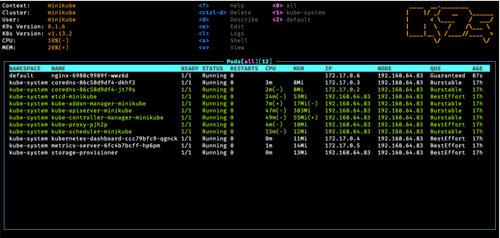

# Lab 01 - Browse Minikube resource

## Setup Minikube completion(Bash)

```
minikube completion bash > ~/.minikube-completion
echo 'source ~/.minikube-completion' >> ~/.bash_profile
exec -l $SHELL
```

## Show Minikube version

```
minikube version
```

Output

```
minikube version: v1.0.1
```

## Start Minikube

```
minikube start
```

Output

```
😄  minikube v1.0.1 on darwin (amd64)
🤹  Downloading Kubernetes v1.14.1 images in the background ...
💡  Tip: Use 'minikube start -p <name>' to create a new cluster, or 'minikube delete' to delete this one.
🔄  Restarting existing virtualbox VM for "minikube" ...
⌛  Waiting for SSH access ...
📶  "minikube" IP address is 192.168.99.100
🐳  Configuring Docker as the container runtime ...
🐳  Version of container runtime is 18.06.3-ce
⌛  Waiting for image downloads to complete ...
✨  Preparing Kubernetes environment ...
🚜  Pulling images required by Kubernetes v1.14.1 ...
🔄  Relaunching Kubernetes v1.14.1 using kubeadm ...
⌛  Waiting for pods: apiserver proxy etcd scheduler controller dns
📯  Updating kube-proxy configuration ...
🤔  Verifying component health ......
💗  kubectl is now configured to use "minikube"
🏄  Done! Thank you for using minikube!
```

## Show Minikube status

```
minikube status
```

Output
```
host: Running
kubelet: Running
apiserver: Running
kubectl: Correctly Configured: pointing to minikube-vm at 192.168.99.100
```

## Show Minikube Node IP

```
minikube ip
```

Output

```
192.168.99.100
```

Ping test

```
ping $(minikube ip)
```

## Show Minikube addons

```
minikube addons list
```

Output

```
- addon-manager: enabled
- dashboard: enabled
- default-storageclass: enabled
- efk: disabled
- freshpod: disabled
- gvisor: disabled
- heapster: disabled
- ingress: disabled
- logviewer: disabled
- metrics-server: disabled
- nvidia-driver-installer: disabled
- nvidia-gpu-device-plugin: disabled
- registry: disabled
- registry-creds: disabled
- storage-provisioner: enabled
- storage-provisioner-gluster: disabled
```

## Delete Cluster

```
minikube delete
```

----

## Check kubectl context

```
kubectl config current-context
```

Output

```
minikube
```

__Show the cluster information of curreent context__

```
kubectl cluster-info
```

Output

```
Kubernetes master is running at https://192.168.99.100:8443
CoreDNS is running at https://192.168.99.100:8443/api/v1/namespaces/kube-system/services/kube-dns:dns/proxy

To further debug and diagnose cluster problems, use 'kubectl cluster-info dump'.
```

```
kubectl config current-context
```

__Show all context__

```
kubectl config get-contexts
```

All available contexts are record in `~/.kube/config`.

Show pods in current context.

```
kubectl get pods
```

__Set a new context__

```
kubectl config set-context mini-system \
  --cluster=minikube \
  --user=minikube \
  --namespace=kube-system
```

__Set current context__

```
kubectl config use-context mini-system
```

```
kubectl config current-context
```

Show pods in current context.

```
kubectl get pods
```

__Clean__

```
kubectl config delete-context mini-system
```

```
kubectl config use-context minikube
```

## Kubectx

Install [kubnectx](https://github.com/ahmetb/kubectx).

```
kubectx
```

## K9s

A greate terminal UI for Kubernetes

[GitHub Repository](https://github.com/derailed/k9s)

__Start__

```
k9s
```



----

## Show Nodes

```
kubectl get nodes
```

__In short__

```
kubectl get no
```

__More Information__

```
kubectl get nodes -o wide
```

__Detail__

```
kubectl describe nodes
```

__Field explain__

```
kubectl explain nodes
```
