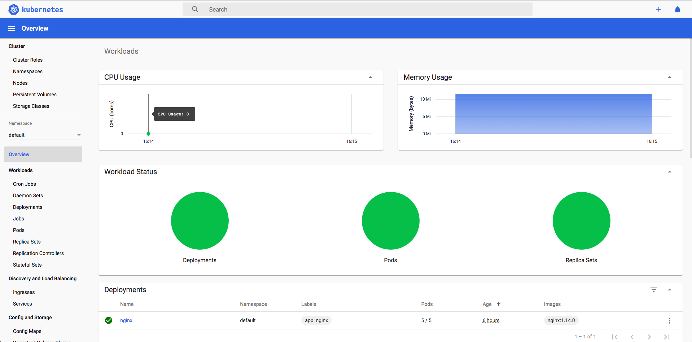

# Lab 01 - Browse Minikube resource

## Setup Minikube completion(Bash)

```
minikube completion bash > ~/.minikube-completion
echo 'source ~/.minikube-completion' >> ~/.bash_profile
exec -l $SHELL
```

## Show Minikube version

```
minikube version
```

Output

```
minikube version: v1.7.2
```

## Start Minikube

```
minikube start
```

Output

```
😄  minikube v1.7.2 on Darwin 10.12.6
✨  Using the virtualbox driver based on user configuration
🔥  Creating virtualbox VM (CPUs=2, Memory=2000MB, Disk=20000MB) ...
🐳  Preparing Kubernetes v1.17.2 on Docker 19.03.5 ...
🚀  Launching Kubernetes ...
🌟  Enabling addons: default-storageclass, storage-provisioner
⌛  Waiting for cluster to come online ...
🏄  Done! kubectl is now configured to use "minikube"
```

## Show Minikube status

```
minikube status
```

Output
```
host: Running
kubelet: Running
apiserver: Running
kubeconfig: Configured
```

## Show Minikube Node IP

```
minikube ip
```

Output

```
192.168.99.101
```

Ping test

```
ping $(minikube ip)
```

## Show Minikube addons

```
minikube addons list
```

Output

```
|-----------------------------|----------|--------------|
|         ADDON NAME          | PROFILE  |    STATUS    |
|-----------------------------|----------|--------------|
| dashboard                   | minikube | disabled     |
| default-storageclass        | minikube | enabled ✅   |
| efk                         | minikube | disabled     |
| freshpod                    | minikube | disabled     |
| gvisor                      | minikube | disabled     |
| helm-tiller                 | minikube | disabled     |
| ingress                     | minikube | disabled     |
| ingress-dns                 | minikube | disabled     |
| istio                       | minikube | disabled     |
| istio-provisioner           | minikube | disabled     |
| logviewer                   | minikube | disabled     |
| metrics-server              | minikube | disabled     |
| nvidia-driver-installer     | minikube | disabled     |
| nvidia-gpu-device-plugin    | minikube | disabled     |
| registry                    | minikube | disabled     |
| registry-creds              | minikube | disabled     |
| storage-provisioner         | minikube | enabled ✅   |
| storage-provisioner-gluster | minikube | disabled     |
|-----------------------------|----------|--------------|
```

## Delete Cluster

```
minikube delete
```

----

## Check kubectl context

```
kubectl config current-context
```

Output

```
minikube
```

__Show the cluster information of curreent context__

```
kubectl cluster-info
```

Output

```
Kubernetes master is running at https://192.168.99.101:8443
KubeDNS is running at https://192.168.99.101:8443/api/v1/namespaces/kube-system/services/kube-dns:dns/proxy

To further debug and diagnose cluster problems, use 'kubectl cluster-info dump'.
```

```
kubectl config current-context
```

__Show all context__

```
kubectl config get-contexts
```

All available contexts are record in `~/.kube/config`.

Show pods in current context.

```
kubectl get pods
```

__Set a new context__

```
kubectl config set-context mini-system \
  --cluster=minikube \
  --user=minikube \
  --namespace=kube-system
```

__Set current context__

```
kubectl config use-context mini-system
```

```
kubectl config current-context
```

Show pods in current context.

```
kubectl get pods
```

__Clean__

```
kubectl config delete-context mini-system
```

```
kubectl config use-context minikube
```

## Kubectx

Install [kubnectx](https://github.com/ahmetb/kubectx).

```
kubectx
```

## K9s

A greate terminal UI for Kubernetes

[GitHub Repository](https://github.com/derailed/k9s)

__Start__

```
k9s
```


----

## Show Nodes

```
kubectl get nodes
```

__In short__

```
kubectl get no
```

__More Information__

```
kubectl get nodes -o wide
```

__Detail__

```
kubectl describe nodes
```

__Field explain__

```
kubectl explain nodes
```

----

## Kubernetes Dashboard

Install kubernetes dashboard

```
minikube addons enable dashboard
```

Access kubernetes dashboard

```
minikube dashboard
```


