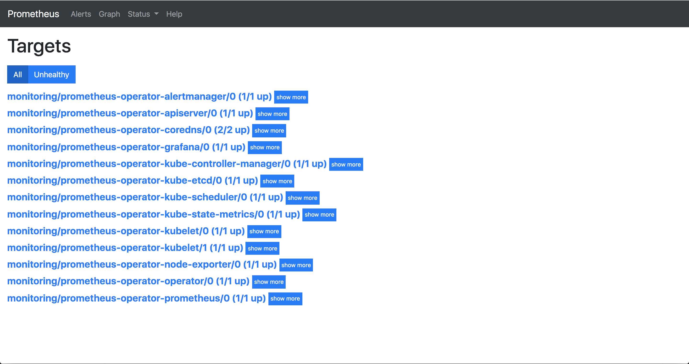

# Lab 07 - Monitoring

## Check metrics

```
kubectl top nodes
```

Output

```
Error from server (NotFound): the server could not find the requested resource (get services http:heapster:)
```

## Enable metrics-server

```
minikube addons list
```

Output

```
- addon-manager: enabled
- dashboard: enabled
- default-storageclass: enabled
- efk: disabled
- freshpod: disabled
- gvisor: disabled
- heapster: disabled
- ingress: enabled
- logviewer: disabled
- metrics-server: disabled
- nvidia-driver-installer: disabled
- nvidia-gpu-device-plugin: disabled
- registry: disabled
- registry-creds: disabled
- storage-provisioner: enabled
- storage-provisioner-gluster: disabled
```

```
minikube addons enable metrics-server
```

Output

```
✅  metrics-server was successfully enabled
```

Confirm the metrics-server pod is running

```
kubectl get pods --all-namespaces -w
```

Wait a minute...

```
kubectl top nodes
```

```
NAME       CPU(cores)   CPU%      MEMORY(bytes)   MEMORY%
minikube   240m         12%       1652Mi          87%
```

```
kubectl top po --all-namespaces
```

## Install Prometheus-operator on minikube

[Prometheus-operator](https://github.com/helm/charts/tree/master/stable/prometheus-operator)

__Reset minikube__

```
minikube stop

minikube start \
    --extra-config=kubelet.authentication-token-webhook=true \
    --extra-config=kubelet.authorization-mode=Webhook \
    --extra-config=scheduler.address=0.0.0.0 \
    --extra-config=controller-manager.address=0.0.0.0
```

__Create Namespace__

```
kubectl create namespace monitoring
```

__Create Secret for ectd__

We need the cert to access etcd.

```
kubectl create secret generic etcd-certs -nmonitoring \
  --from-literal=ca.crt="$(kubectl exec kube-apiserver-minikube -nkube-system -- cat /var/lib/minikube/certs/etcd/ca.crt)" \
  --from-literal=client.crt="$(kubectl exec kube-apiserver-minikube -nkube-system -- cat /var/lib/minikube/certs/apiserver-etcd-client.crt)" \
  --from-literal=client.key="$(kubectl exec kube-apiserver-minikube -nkube-system -- cat /var/lib/minikube/certs/apiserver-etcd-client.key)"
```

__Create Service Account for Helm__

```
kubectl create serviceaccount tiller \
  --namespace kube-system

kubectl create clusterrolebinding tiller-role-binding \
  --clusterrole cluster-admin \
  --serviceaccount=kube-system:tiller
```

Edit `value.yaml`, remeber change `CHANGE_IT` with the value of `minikube ip`.

This is because the Minikube set the endpoint of etcd as Minikube ip.

```
prometheus:
  prometheusSpec:
    secrets: [etcd-certs]
kubeEtcd:
  endpoint: [CHANGE_IT] # change it with `minikube ip`
  serviceMonitor:
    scheme: https
    caFile:   /etc/prometheus/secrets/etcd-certs/ca.crt
    certFile: /etc/prometheus/secrets/etcd-certs/client.crt
    keyFile:  /etc/prometheus/secrets/etcd-certs/client.key
```

__Install Helm__

```
brew install kubernetes-helm
```

```
helm init --service-account tiller
```

Update Repository

```
helm repo update
```

Install prometheus-operator

```
helm install stable/prometheus-operator \
  --name prometheus-operator \
  --namespace monitoring \
  --values value.yaml
```

Check operator

```
kubectl get pods -n monitoring
```

__Access Prometheus__

```
kubectl port-forward -n monitoring svc/prometheus-operator-prometheus 9090
```

Browse http://localhost:9090/

Check "Status -> Targets" page.



__Access Grafana__

```
kubectl port-forward -n monitoring svc/prometheus-operator-grafana 8080:80
```

Browse http://localhost:8080/

```
User: admin
Password: prom-operator
```


## Clear

```
helm delete --purge prometheus-operator
kubectl delete crd prometheuses.monitoring.coreos.com
kubectl delete crd prometheusrules.monitoring.coreos.com
kubectl delete crd servicemonitors.monitoring.coreos.com
kubectl delete crd alertmanagers.monitoring.coreos.com
kubectl delete namespace monitoring
```